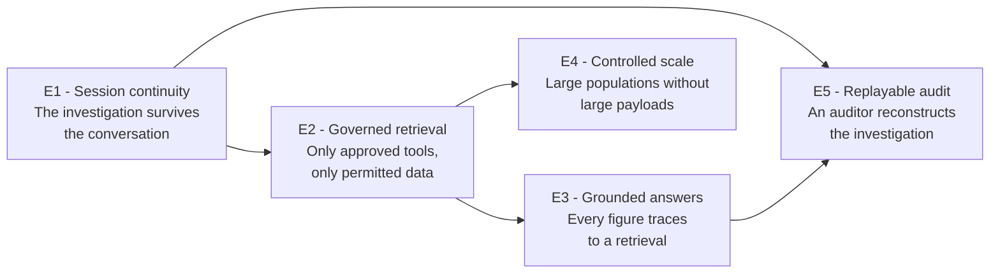
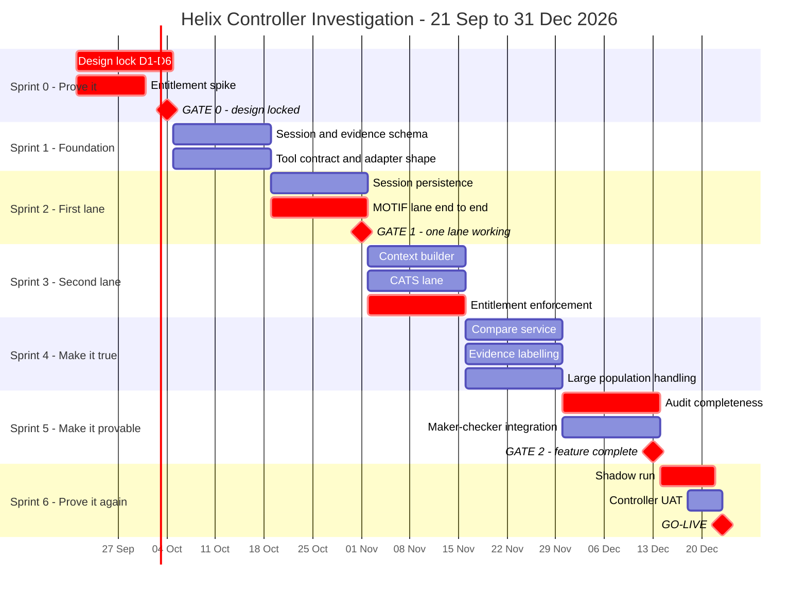
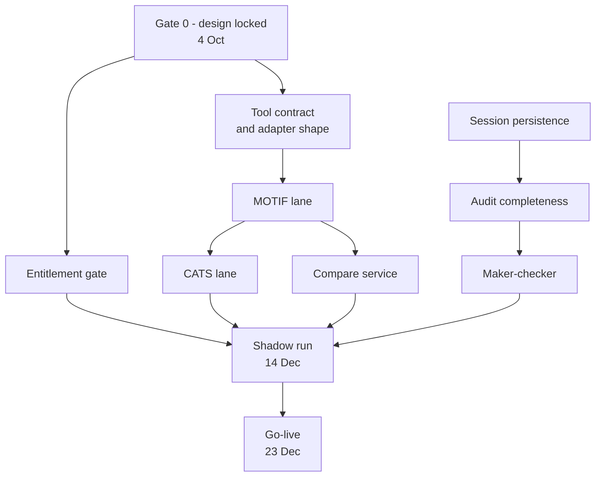

# Helix Controller Investigation
## Story-based Business Requirements Document

| | |
|---|---|
| **Document** | Helix Controller Investigation - Story-based BRD |
| **Version** | 1.0 |
| **Owner** | Finance Technology Architecture |
| **Delivery window** | Mon 21 Sep 2026 to Thu 31 Dec 2026 (14.5 weeks, 7 sprints) |
| **Companion document** | Helix Controller Investigation Model - BRD (architecture and controls) |
| **Status** | Proposed. Sprint 0 exists to confirm the assumptions this plan rests on |

---

## 1. The story we are telling

### 1.1 Today

It is 06:00 in Singapore. The overnight Helix run has finished and produced an analysis for
every reconciliation in scope. Priya, a FOBO controller, opens the Control Tower and reads the
first one: a difference between the CATS front-office value and the MOTIF back-office value on
a master book she owns.

She believes the analysis. She just cannot interrogate it.

To find out *why* the values differ, she opens a MOTIF query screen in another window, runs a
filter she has memorised, copies three figures into a spreadsheet, opens a CATS extract, finds
the matching book, and compares by eye. Twenty minutes later she knows the nostro statement
arrived after the cutoff. She records the decision in the Control Tower. The spreadsheet is
deleted. The reasoning is gone.

Tomorrow a different controller will meet the same break and repeat the same twenty minutes.
If an auditor asks in March how that decision was reached, the answer is a decision code and
somebody's memory.

### 1.2 What we are building

The same morning, after this delivery. Priya reads the analysis and types:

> *Why do the CATS and MOTIF values differ on this book?*

Helix checks what the overnight run already retrieved. The MOTIF value is there; the CATS value
is not. It identifies CATS as the owning application, calls the approved CATS tool with her
entitlement applied, and gets back the book values - filtered at source, labelled CATS, stamped
09:14. A deterministic compare service produces the difference. Helix explains it, keeping the
overnight evidence and the new evidence visually separate.

Ninety seconds. Priya records the decision. Every figure traces to a retrieval, every retrieval
to an entitlement check, and the whole exchange sits under one investigation session that an
auditor can replay in March.

### 1.3 What success looks like on 31 December

| Measure | Today | Target at go-live |
|---|---|---|
| Time to investigate one non-trivial break | 15-25 minutes | Under 3 minutes |
| Systems the controller opens | 3-4 | 1 |
| Investigation reasoning retained | None | Full session, replayable |
| Evidence traceable to source and time | No | Every item |
| Entitlement enforced on investigation queries | Manual, per system | Automatic, per call, logged |

---

## 2. The people in the story

| Persona | Role | What they need | How we know we succeeded |
|---|---|---|---|
| **Priya - FOBO controller** | Investigates and signs off breaks daily | To ask a question in her own words and get a grounded answer without leaving the tool | She stops opening MOTIF and CATS screens during investigation |
| **Marcus - checker** | Second pair of eyes on material adjustments | To see what was asked, what was retrieved and what changed | He can review without asking the maker to explain |
| **Sofia - audit** | Reviews decisions months later | To replay an investigation end to end | She reconstructs a March decision without contacting the controller |
| **Raj - source system owner (MOTIF)** | Owns MOTIF access and data | To know exactly which queries Helix can run and see every call | He can point to an allow-list and a call log |
| **Elena - controls** | Owns maker-checker and entitlement policy | Material actions stay with a human; access is enforced before data moves | No investigation path bypasses the entitlement gate |

---

## 3. Epics

| Epic | Statement | Why it matters |
|---|---|---|
| **E1 - Session continuity** | The investigation lives in Helix, not in a model conversation, so it can be resumed, handed over and replayed | Without this, everything else is ephemeral |
| **E2 - Governed retrieval** | Helix retrieves only from the owning application, through an approved tool, after an entitlement check | This is what makes the capability releasable in a bank |
| **E3 - Grounded answers** | Every figure in an explanation traces to a retrieval; comparisons run in deterministic code | A number in a financial adjustment must be reproducible |
| **E4 - Controlled scale** | Large exception populations are filtered and aggregated at source, never passed whole to a model | Without this the capability breaks on the books that need it most |
| **E5 - Replayable audit** | One session identifier links the overnight run, every controller interaction and the final decision | This is the difference between a demo and a production control |

---

## 4. User stories

Story points use a Fibonacci scale. **MoSCoW**: M = must have for 31 Dec, S = should have,
C = could have, W = won't have this window.

### E1 - Session continuity

| ID | Story | Acceptance criteria | Pts | MoSCoW |
|---|---|---|---|---|
| **S1.1** | As Priya, I want the overnight analysis stored against a session so I can open it and continue where the run left off | Session holds analysis, evidence references, affected book, run and action history. Opening the case shows outcome, explanation, evidence and recommended next step | 8 | M |
| **S1.2** | As Priya, I want my questions and answers appended to that same session so my investigation is one continuous record | New interaction session links user, role and start time to the existing `investigation_session_id`. History is appended, never overwritten | 8 | M |
| **S1.3** | As Priya, I want to close my browser and resume later without losing context | Reopening reconstructs context from stored summary, identifiers and evidence references. No dependency on a live model conversation | 13 | M |
| **S1.4** | As Marcus, I want to pick up an investigation another controller started | Any entitled controller can open the session and see the full prior exchange, attributed by user | 5 | M |
| **S1.5** | As the platform, I want the context package to carry the minimum needed | Context builder supplies summary, identifiers, evidence references and access scope only. Never a full dataset, never credentials | 8 | M |

### E2 - Governed retrieval

| ID | Story | Acceptance criteria | Pts | MoSCoW |
|---|---|---|---|---|
| **S2.1** | As Raj, I want Helix to call only tools I have approved for MOTIF | Tool allow-list per application, enforced server-side. An unlisted tool cannot be invoked | 8 | M |
| **S2.2** | As Elena, I want every call entitlement-checked before any data moves | Entitlement gate runs before retrieval. Denied calls retrieve nothing, display nothing, and are recorded | 13 | M |
| **S2.3** | As Priya, I want Helix to answer from what it already has rather than re-querying | Stored evidence is checked first. A source call happens only when the session lacks the answer | 5 | M |
| **S2.4** | As Raj, I want field-level control over what leaves MOTIF | Field allow-list per tool. Fields outside the list are stripped before the response returns | 8 | M |
| **S2.5** | As Priya, I want a clear failure when a source is unavailable | Source failure is shown as a failure. No substitute or inferred answer is produced | 5 | M |
| **S2.6** | As the platform, I want CATS and Trade Store lanes on the same pattern as MBR and MOTIF | Each application has its own tool group, adapter and owning team. Adding a lane requires no change to the agent | 8 | S |

### E3 - Grounded answers

| ID | Story | Acceptance criteria | Pts | MoSCoW |
|---|---|---|---|---|
| **S3.1** | As Priya, I want each evidence item labelled with its source and retrieval time | Every returned item carries application name and timestamp, visible in the explanation | 5 | M |
| **S3.2** | As Sofia, I want overnight evidence and newly retrieved evidence shown separately | Explanation separates original analysis evidence from evidence added during investigation | 8 | M |
| **S3.3** | As Elena, I want comparisons computed in code, not by the model | Compare service runs versioned deterministic code against linked evidence IDs and returns references with the result | 13 | M |
| **S3.4** | As Priya, I want to see when new evidence changes the original conclusion | Both versions preserved. The change is shown explicitly, not silently overwritten | 8 | M |
| **S3.5** | As Priya, I want to know when an answer is low confidence | Confidence and any missing-data caveat are visible in the explanation | 5 | S |

### E4 - Controlled scale

| ID | Story | Acceptance criteria | Pts | MoSCoW |
|---|---|---|---|---|
| **S4.1** | As Priya, I want a count and summary before rows when the population is large | Summary-first response: counts and grouped totals precede any detailed rows | 8 | M |
| **S4.2** | As Priya, I want to narrow to a group and then page through it | Group selection followed by bounded page plus continuation token | 8 | M |
| **S4.3** | As Raj, I want every tool bounded on rows, fields, time and payload | Limits configured per tool and enforced at the adapter. Truncation is flagged in the response | 8 | M |
| **S4.4** | As the platform, I want no model-generated SQL reaching a source | Fixed query templates or validated filter parameters only | 13 | M |
| **S4.5** | As Priya, I want a bulk export path when a genuine large extract is needed | Asynchronous export job, encrypted storage, expiry, file reference held outside the model context | 13 | **W** - January |

### E5 - Replayable audit

| ID | Story | Acceptance criteria | Pts | MoSCoW |
|---|---|---|---|---|
| **S5.1** | As Sofia, I want every question, call, evidence item and decision recorded | Audit captures question text, application, tool, validated parameters, entitlement result, timing, row count, errors | 13 | M |
| **S5.2** | As Sofia, I want to know which prompt and model produced an explanation | Prompt version, skill version, model identifier and tool policy recorded per interaction | 8 | M |
| **S5.3** | As Sofia, I want to replay an investigation from the audit record alone | A March reviewer reconstructs the full exchange without contacting the controller | 8 | M |
| **S5.4** | As Elena, I want material actions to follow maker-checker | Decisions route to the existing checker queue. Checker sees what was asked, retrieved and changed | 13 | M |
| **S5.5** | As Elena, I want evidence stored by reference where retention rules allow | Reference-first storage. Copies made only where retention and classification permit, encrypted at rest | 8 | S |

**Total committed (M and S):** 215 points across 6 delivery sprints - Sprint 0 carries no
story points. Deferred to January (W): 13 points.

| Sprint | Points | Running total |
|---|---|---|
| Sprint 0 | 0 | 0 |
| Sprint 1 | 37 | 37 |
| Sprint 2 | 31 | 68 |
| Sprint 3 | 34 | 102 |
| Sprint 4 | 42 | 144 |
| Sprint 5 | 50 | 194 |
| Sprint 6 | 21 + hardening | 215 |

Sprint 5 is the heaviest at 50 points and carries Gate 2. If velocity in Sprints 1-3 runs below
34 points, move S5.5 (evidence by reference, 8 pts) to January before Sprint 5 starts rather
than discovering the overrun in December.

---

## 5. The delivery story, sprint by sprint

### 5.1 Timeline

### 5.2 Sprint 0 - Prove the assumptions
**Mon 21 Sep to Sun 4 Oct · 0 story points · Gate 0**

Nothing is built. This sprint exists because the plan rests on six unconfirmed answers, and
discovering in November that MOTIF has no query service would end the December date.

| Activity | Output | Owner |
|---|---|---|
| Confirm D1 - approved source systems per investigation type | Signed list | Helix architecture + source owners |
| Confirm D2 - allowed tools and returned fields per application | Allow-list per application | Source owners |
| Confirm D3 - integration type per application: API, query service, file or restricted adapter | Integration decision per application | Source owners |
| Confirm D4 - retention for sessions, evidence and prompts | Retention policy | Records management |
| Confirm D5 - maker-checker rules and source entitlements | Control design | Elena, controls |
| Confirm D6 - behaviour on unavailable sources and conflicting evidence | Decision rules | Helix architecture |
| Spike the entitlement service integration | Working call, or a flagged risk | Engineering |
| Confirm the year-end change freeze window | Confirmed go-live date | Release management |

**Gate 0 exit:** all six answered, entitlement spike returns a real allow or deny.

**If Gate 0 misses:** the December date is gone. The MCP tool layer is the longest workstream
and sits on the critical path; it cannot start against unknown integration types. Escalate on
29 September if any source owner has not responded.

---

### 5.3 Sprint 1 - Foundation
**Mon 5 Oct to Sun 18 Oct · 37 points**

The first sprint builds the two things everything else sits on: where an investigation lives,
and the shape every tool will take.

| Story | Pts |
|---|---|
| S1.1 - Overnight analysis stored against a session | 8 |
| S1.5 - Context package carries the minimum | 8 |
| S2.1 - Tool allow-list per application, enforced server-side | 8 |
| S4.4 - Fixed query templates, no model-generated SQL | 13 |

**The story at sprint end.** Priya can open yesterday's analysis and see the overnight evidence
attached to it. She cannot ask anything yet. An engineer can define a tool for an application
and it will refuse to run if it is not on the allow-list.

**Demo:** open a real overnight analysis, show the session record behind it, attempt an
unlisted tool call and watch it refused.

---

### 5.4 Sprint 2 - The first lane
**Mon 19 Oct to Sun 1 Nov · 31 points · Gate 1**

MOTIF goes first: it already has a query service, and the worked example needs it. One lane
working end to end proves the pattern that the other three will copy.

| Story | Pts |
|---|---|
| S1.2 - Questions appended to the same session | 8 |
| S1.4 - Another controller can pick up an investigation | 5 |
| S2.3 - Answer from stored evidence before calling a source | 5 |
| S2.4 - Field-level allow-list on retrieval | 8 |
| S2.5 - Clear failure when a source is unavailable | 5 |

**The story at sprint end.** Priya asks a question about a MOTIF exception. Helix checks the
session, finds it lacks the detail, calls the MOTIF tool, and answers. The exchange is stored.
If MOTIF is down she is told so, and no answer is invented.

**Gate 1 exit:** one full question-to-answer cycle against a real source, in a test region.

**Demo:** ask "show me the MOTIF exception detail for this book" and get a grounded answer.

---

### 5.5 Sprint 3 - The second lane and the gate
**Mon 2 Nov to Sun 15 Nov · 34 points**

Two lanes prove the pattern generalises. The entitlement gate turns a working capability into
a releasable one.

| Story | Pts |
|---|---|
| S1.3 - Resume after closing the browser | 13 |
| S2.2 - Entitlement check before any data moves | 13 |
| S2.6 - CATS lane on the same pattern | 8 |

**The story at sprint end.** Priya can now ask about both CATS and MOTIF. A book outside her
scope returns a recorded refusal and no data. She can close her laptop at 11:00, reopen at
14:00, and continue the same investigation.

**Demo:** the CATS versus MOTIF worked example from the architecture BRD, run live - including
an entitlement denial.

---

### 5.6 Sprint 4 - Make the answers true
**Mon 16 Nov to Sun 29 Nov · 42 points**

Retrieval works. This sprint makes the answers defensible: figures computed in code, evidence
labelled by source, and large populations handled without large payloads.

| Story | Pts |
|---|---|
| S3.1 - Evidence labelled by source and retrieval time | 5 |
| S3.2 - Overnight and new evidence shown separately | 8 |
| S3.3 - Comparisons in deterministic code | 13 |
| S4.1 - Count and summary before rows | 8 |
| S4.3 - Row, field, time and payload limits per tool | 8 |

**The story at sprint end.** Priya asks about a reconciliation with 4,800 breaks and gets
"4,812 breaks, grouped by type" rather than a timeout. The CATS-versus-MOTIF difference is
computed by the compare service and carries its evidence references. Marcus can see which
figures came from the overnight run and which Priya pulled this morning.

**Demo:** a large-population question answered in under three seconds, and a compare result
traced back to two specific retrievals.

---

### 5.7 Sprint 5 - Make it provable
**Mon 30 Nov to Sun 13 Dec · 50 points · Gate 2**

Everything a controller needs now works. This sprint is for Sofia and Elena - the audit record
and the maker-checker path that make it releasable.

| Story | Pts |
|---|---|
| S3.4 - Show when new evidence changes the conclusion | 8 |
| S4.2 - Narrow to a group and page through it | 8 |
| S5.1 - Full audit of questions, calls, evidence and decisions | 13 |
| S5.2 - Prompt, skill and model versions recorded | 8 |
| S5.4 - Maker-checker integration | 13 |

**The story at sprint end.** Sofia can open an investigation from last week and replay it. She
sees the question, the tool called, the parameters, the entitlement result, what returned, and
what the controller decided. Marcus reviews a material adjustment in the existing checker queue.

**Gate 2 exit:** every must-have story has a passing test. Sofia signs off that she can
reconstruct an investigation from the audit record alone.

**If Gate 2 misses:** narrow the go-live scope - one region instead of three, or one
reconciliation type. Do not compress the shadow run or UAT.

---

### 5.8 Sprint 6 - Prove it again, then release
**Mon 14 Dec to Sun 27 Dec · 21 story points plus hardening · Go-live**

No new capability. This sprint is the evidence that the capability is safe.

| Activity | Dates | Exit |
|---|---|---|
| **Shadow run** - investigation available alongside the current process, results compared | 14-21 Dec | No unexplained divergence from controller conclusions |
| **Controller UAT** - Priya and two peers use it on live analyses | 18-22 Dec | Sign-off from all three |
| **Go-live** - limited population | 23 Dec | Controls sign-off received |

| Story | Pts |
|---|---|
| S3.5 - Low-confidence and missing-data caveats visible | 5 |
| S5.3 - Replay an investigation from the audit record alone | 8 |
| S5.5 - Evidence stored by reference where retention allows | 8 |
| Defect burn-down and hardening | 13 |

**The story at sprint end.** Priya investigates a real break on a live business date, in one
system, in under three minutes, and the investigation is replayable in March.

---

## 6. Scope decisions

These are choices that make 31 December achievable. Each is reversible in January.

| Decision | What ships in December | What follows |
|---|---|---|
| **Two applications, not four** | MOTIF and CATS - they cover the primary worked example | MBR and Trade Store lanes in January. The pattern is proven; each is roughly one sprint |
| **One region first** | APAC - earliest shift, so problems surface before EMEA and AMER start | EMEA and AMER in January, no code change expected |
| **One reconciliation type** | The CATS versus MOTIF cash reconciliation | Others follow as source approvals complete |
| **No bulk export** | Scope, summarise, narrow, page and detail cover the December population | S4.5 in January if a genuine need appears |
| **Read-only investigation** | Controller records a decision; Helix does not post | Automated posting only after the audit record has run a full cycle in production |

---

## 7. Dependencies

| Dependency | Needed by | Owner | Risk if late |
|---|---|---|---|
| MOTIF query service access and allow-list | 19 Oct, Sprint 2 | Raj | Sprint 2 cannot start. Critical path |
| CATS integration decision - file or API | 2 Nov, Sprint 3 | CATS owner | CATS lane slips to January; go-live becomes MOTIF only |
| Entitlement service integration | 2 Nov, Sprint 3 | Platform security | Blocks release entirely. Spiked in Sprint 0 for this reason |
| Checker queue interface | 30 Nov, Sprint 5 | Controls engineering | Material adjustments cannot be released |
| Test data on a live business date | 14 Dec, Sprint 6 | Ops | Shadow run cannot be meaningful |
| Year-end change freeze window | Confirm in Sprint 0 | Release management | Go-live moves to 15 Dec or January |

---

## 8. Risks

| # | Risk | Likelihood | Impact | Response |
|---|---|---|---|---|
| R1 | Source owners do not confirm allow-lists by 4 Oct | Medium | Critical - date lost | Sessions booked in week 1. Escalate 29 Sep on any non-response |
| R2 | Entitlement integration harder than assumed | Medium | Critical - blocks release | Spiked in Sprint 0, before any dependent work is committed |
| R3 | CATS has no governed service, only a file extract | Medium | High - lane slips | Sprint 0 decision point. Fall back to MOTIF-only go-live |
| R4 | Year-end freeze starts before 23 Dec | High | High - go-live blocked | Confirm in Sprint 0. Target 15 Dec or hold to January |
| R5 | Shadow run shows divergence from controller conclusions | Low | High - delay | Eight-day window starting 14 Dec is the buffer |
| R6 | Controller availability for UAT in late December | High | Medium | Book Priya and two peers now, before holiday plans are set |
| R7 | Model selects a plausible but wrong tool | Medium | Medium | Allow-list bounds it. Wrong-tool selections logged and reviewed weekly from Sprint 2 |
| R8 | Large-population handling insufficient on the worst books | Low | Medium | Test against the largest real reconciliation in Sprint 4, not Sprint 6 |

---

## 9. Definition of done

A story is done when all of the following hold.

- Acceptance criteria demonstrated on a live analysis, not a fixture
- Entitlement enforced on every path the story introduces
- Every source call logged with application, tool, parameters, entitlement result, timing and row count
- No figure reaches a controller that cannot be traced to a retrieval
- Failure path tested: source unavailable, access denied, result truncated
- Reviewed by the owning source-system representative where the story touches their application

---

## 10. What happens in January

Not commitments. The shape of the next window, so December decisions are made knowing what
follows.

| | Scope |
|---|---|
| **January** | MBR and Trade Store lanes. EMEA and AMER regions. Bulk export path (S4.5) |
| **February** | Additional reconciliation types as source approvals complete. Cross-source tools |
| **Under review** | Automated posting, only after the audit record has run a full production cycle and controls have reviewed it |

---

## 11. Open questions for Sprint 0

| # | Question | Blocks | Needed by |
|---|---|---|---|
| Q1 | Does MOTIF expose a query service Helix can call, or only a database? | Sprint 2 | 4 Oct |
| Q2 | Is CATS available as an API, or only a controlled file extract? | Sprint 3 | 4 Oct |
| Q3 | Which fields may leave each application? | Sprints 2-3 | 4 Oct |
| Q4 | What retention applies to sessions, evidence and prompts? | Sprint 1 schema | 4 Oct |
| Q5 | Does a bulk approve create one checker item or many? | Sprint 5 | 15 Nov |
| Q6 | When does the year-end change freeze begin? | Go-live date | 4 Oct |
